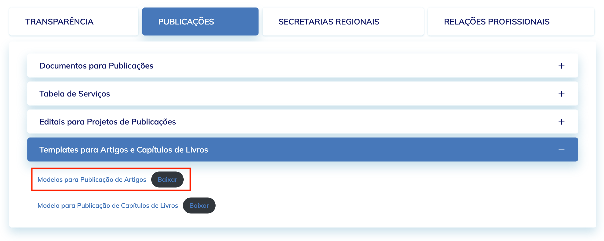

# Pós-graduação Lato Sensu em Ciência de Dados e Inteligência Artificial


> [!NOTE]
> A respeito do uso de Inteligência Artificial: quando necessário, LLMs são utilizadas para geração de código. Contudo, todo código gerado é **sempre** revisado por mim, [@rodolfo-brandao](https://github.com/rodolfo-brandao), autor e único contribuidor deste repositório.
>
> O que me fez adotar essa abordagem? [Este post](https://x.com/karpathy/status/2015883857489522876) do [Andrej Karpathy](https://github.com/karpathy) e [esta nota](https://www-cs-faculty.stanford.edu/~knuth/papers/claude-cycles.pdf) de ninguém menos que [Donald Knuth](https://en.wikipedia.org/wiki/Donald_Knuth).
>
> Nas palavras do próprio Karpathy: _It hurts the ego a bit_ :hurtrealbad:
>
> Para as demais necessidades, o [Claude Code](https://claude.ai/code) é utilizado como ferramenta de análise e insights — para melhor entendimento de bases de código, documentações e trade-offs, além de apoiar em tomadas de decisão.

## Módulos

1. [Introdução, Definições e Exemplos](src/modulo-01) (2025)
2. [Linguagem Python com Foco em Análise de Dados](src/modulo-02) (2025)
3. [Linguagem R com Foco em Análise de Dados](src/modulo-03) (2025)
4. [Estatística - Análise Descritiva, Probabilidade e Inferência com R](src/modulo-04) (2025)
5. [Estatística - Análise Descritiva, Probabilidade e Inferência com Python](src/modulo-05) (2025)
6. [Álgebra Linear para Ciência de Dados](src/modulo-06) (2025)
7. [Banco de Dados - Relacionais, Não Relacionais e Tópicos Avançados](src/modulo-07) (2025)
8. [Pré-processamento de Dados](src/modulo-08) (2026)
9. [Visualização de Dados](src/modulo-09/) (2026)
10. [Machine Learning - Teoria](src/modulo-10/) (2026)
11. [Machine Learning - Teoria e Prática I](src/modulo-11/) (2026)
12. [Machine Learning - Teoria e Prática II](src/modulo-12/) (2026)

## Setup Inicial

### Requerimentos

- [x] [Python 3.14](https://www.python.org/downloads/release/python-3140/)
- [x] [uv](https://docs.astral.sh/uv/)

### Setup

1. Clonar repositório & navegar até sua pasta raiz:
```bash
git clone https://github.com/rodolfo-brandao/pos-graduacao.git && \
cd pos-graduacao
```

2. Criar `.venv` e ativá-lo:
```bash
uv venv .venv && \
source .venv/bin/activate
```

3. Instalar dependências no respectivo `.venv`:
```bash
uv sync
```

4. Copiar `.env.example` para `.env` e preencher os campos necessários:
```bash
cp .env.example .env
```

## Trabalho de Conclusão de Curso

### Sobre o Projeto

O trabalho final consiste no desenvolvimento de um sistema RAG (*Retrieval-Augmented Generation*) integrado a uma base de conhecimento em grafos, construída em conjunto desse projeto, com o objetivo de orquestrar agentes de IA capazes de:

- Interpretar e identificar a intenção semântica em perguntas de usuários em linguagem natural
   - Ex: `Show me thrillers directed by someone who worked with Denis Villeneuve, released after 2015, with high critical reception`
- Elaborar e executar consultas complexas em Cypher sobre o grafo de conhecimento
- Sumarizar os resultados e produzir respostas em linguagem natural

O projeto é denominado **Cinematica** e está disponível em repositório próprio no GitHub, acessível [aqui](https://github.com/rodolfo-brandao/cinematica).

### Sobre o Artigo

[](https://www.overleaf.com/read/dwkpqfrqpcfk#41fa5e)

A produção do artigo do projeto final será baseado no template oficial da [Sociedade Brasileira de Computação (SBC)](https://www.sbc.org.br/), no qual pode ser acessado [aqui](https://www.sbc.org.br/documentosinstitucionais/#publicacoes).

Na última seção de menus do portal, basta navegar sobre:

```
Publicações
├──Templates para Artigos e Capítulos de Livros
   └── Modelos para Publicação de Artigos
```


