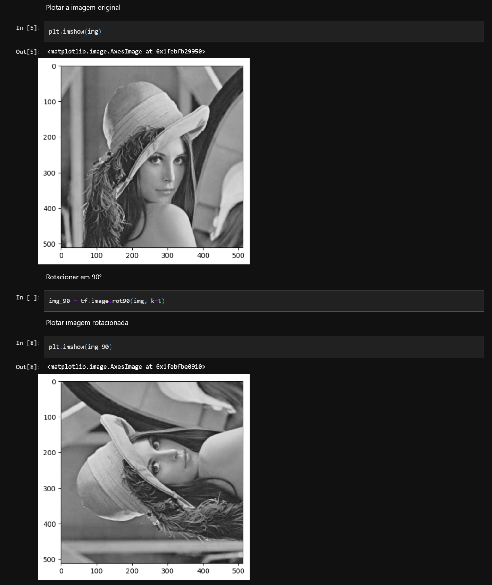
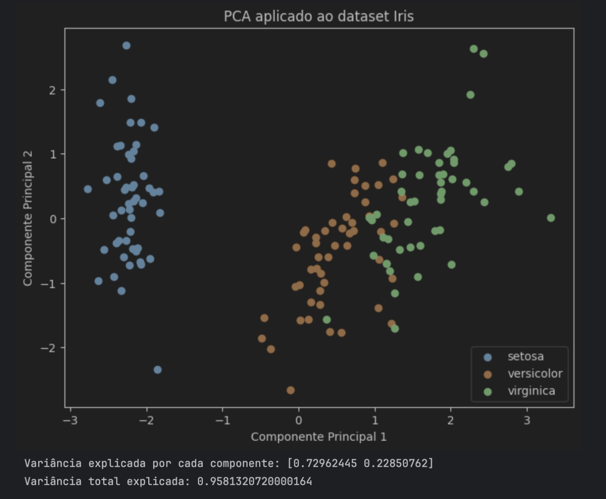

# Aplicações Sobre Transformações Lineares e PCA

29/10/2025

Alunos
- Cleiton Alves
- Rodolfo Brandão

## 1. Introdução Teórica

Transformações Lineares (TL) são conceitos fundamentais aplicados em diversas áreas da Ciência de Dados e Machine Learning, incluindo o tratamento, a compressão e a visualização de dados, por exemplo. Operações matriciais como rotação, translação, escala e reflexão, são utilizadas para aumento de dados (_data augmentation_) em imagens. Em modelos de Deep Learning, as TLs são a base das camadas lineares (Dense Layers) e das projeções lineares em espaços latentes, sendo essenciais para a representação eficiente de informações.

A **Análise de Componentes Principais** (PCA) é uma técnica de redução de dimensionalidade linear e não supervisionada. O principal objetivo da PCA é transformar um conjunto de observações de variáveis possivelmente correlacionadas em um novo conjunto de variáveis linearmente não correlacionadas, denominadas componentes principais (CPs). Este procedimento é realizado por meio de uma transformação ortogonal. A PCA tenta preservar as partes essenciais dos dados que possuem mais variabilidade, ao mesmo tempo em que remove as partes com menos variabilidade. Ao projetar os dados em uma dimensão inferior, a PCA permite a visualização de dados de alta dimensão em um espaço 2D ou 3D, facilitando a exploração dos dados.

Ambas as técnicas podem ser aplicadas em **Visualização de Dados** (em um mundo onde grandes quantidades de dados são produzidas constantemente, ter clareza das informações trabalhadas ajuda bastante no entendimento dos problemas), e **Aceleração de Algoritmo de Machine Learning** (é possível tirar proveito do PCA para reduzir a dimensionalidade para acelerar o tempo de treinamento e teste dos algoritmos).

## 2. Descrição dos Exemplos Produzidos

### Rotação de Imagem

#### Execução e Reprodução

O exemplo demonstrado acima se trata da aplicação de transformação linear para rotação de imagens, utilizando a biblioteca Python **TensforFlow** (TF). No código criado, foi realizado o setup inicial (instalação da biblioteca e importação dela), em seguida, foi carregada a imagem para uma variável no código, permitindo a leitura e tratamento dos seus dados via TF (leitura dos bytes e inclusão de uma dimensão extra por conta da imagem ser em preto e branco). Por fim, utilizando o método `tf.image rot90`, passando o tensor escalar `k=1` (indicando que a imagem seria rotacionada uma única vez), foi possível, de fato, aplicar a rotação 90° na imagem.

#### Análise Conceitual

No caso especial em que $\theta$ é um múltiplo de 90, a matriz de rotação assume formas particularmente simples. Esses ângulos de quartos de volta (90°, 180°, 270°) são comumente usados em processamento de imagens por produzirem alinhamentos exatos na grade de pixels (sem necessidade de interpolação fracionária). Perceba que todas essas matrizes de rotação são linearmente independentes. Quando rotacionar uma imagem digital, estamos efetivamente aplicando uma rotação (transformação linear) às coordenadas de todos os seus pixels. Pensando que uma imagem é, basicamente, um conjunto de pontos coloridos distribuídos em uma grade, no exemplo de rotação de 90° à esquerda, na imagem original todos os pixels da foto foram girados em torno do centro da imagem, mantendo as distâncias relativas entre si, gerando uma nova imagem rotacionada. Em algoritmos de processamento de imagens, aplicar essa transformação significa mapear os valores de cor dos pixels para novas posições. Em resumo, podemos classificar rotações de imagens como transformações lineares porque podem ser representadas por uma matriz agindo linearmente sobre coordenadas.

### Classificação de Dados

#### Execução e Reprodução

O código em questão carrega o dataset Íris (disponível na biblioteca **Scikit-Learn**), padroniza seus atributos para que todos fiquem na mesma escala, e aplica PCA para reduzir as 4 variáveis originais (comprimento/largura de sépalas e pétalas) para apenas 2 componentes principais, preservando a maior parte da variabilidade dos dados. Em seguida, ele exibe um gráfico de dispersão mostrando como as três espécies de flores se distribuem nesse novo espaço bidimensional, facilitando a visualização da separação entre elas, e imprime a variância explicada por cada componente e a variância total mantida pela redução.

#### Análise Conceitual

A transformação aplicada é uma projeção linear dos dados em um novo espaço formado pelos componentes principais. Essencialmente, o algoritmo encontra uma nova base (um novo sistema de eixos) onde os dados são rotacionados e projetados de forma que as direções de maior variabilidade fiquem nos primeiros eixos. Matematicamente, essa operação é representada como uma multiplicação matricial: se $X$ é a matriz de dados padronizados e $W$ é a matriz cujas colunas são os autovetores escolhidos, a transformação é $X(pca) = XW$. Assim, cada ponto em alta dimensão é projetado em um espaço de menor dimensão usando combinações lineares dos atributos originais. Os autovalores e autovetores da matriz de covariância dos dados desempenham papel central: os autovetores definem as novas direções principais (componentes) e os autovalores indicam a importância de cada direção, ou seja, quanta variância é explicada. O impacto da transformação é que parte da informação pode ser perdida (pois descartamos componentes com baixa variância), mas geralmente há um ganho em simplificação e visualização, além de possível separação mais clara entre classes. Essa transformação é linear, porque cada novo componente é uma combinação linear dos atributos originais, o que pode ser formalmente justificado pelo fato de o PCA se basear em autodecomposição de uma matriz simétrica (a de covariância), resultando em operações estritamente lineares.

## 3. Discussão Final

Sobre transformações lineares no aspecto de Machine Learning, nada mais são que vetores em um espaço multidimensional em novas representações que facilitam análise, classificação e previsão. Tomando como exemplo modelos como regressão linear, SVM e redes neurais, estes dependem de multiplicações de matrizes (operações lineares) para combinar, projetar e rotacionar esses vetores em direções que revelam padrões ou separações úteis. Isso permite entender relações entre variáveis, reduzir dimensionalidade (como no PCA) e aproximar funções complexas de forma eficiente.

Já sobre PCA, este pode ser visto como uma transformação linear porque cada componente principal é construído a partir de combinações lineares das variáveis originais. Isso significa que o algoritmo encontra novas direções no espaço de atributos definidas pelos autovetores da matriz de covariância e projeta os dados sobre essas direções. No exemplo do dataset Íris, os quatro atributos originais (comprimento e largura de sépalas e pétalas) são combinados linearmente para gerar dois novos eixos (componentes principais) que explicam a maior parte da variabilidade presente nos dados. Quanto às suas vantagens, estas incluem a redução da dimensionalidade, que simplifica o conjunto de dados sem perder muita informação, facilita a visualização em 2D ou 3D, e pode melhorar a eficiência de algoritmos de machine learning, além de reduzir ruído ao descartar componentes pouco relevantes.