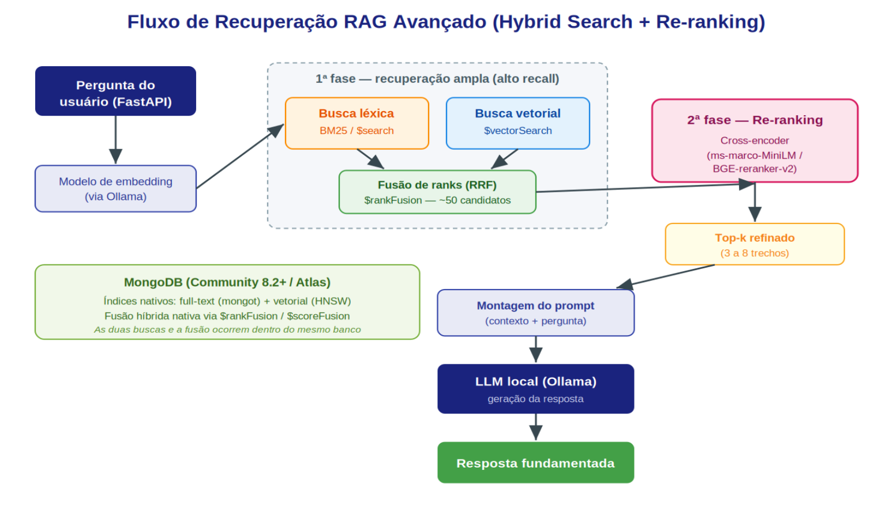
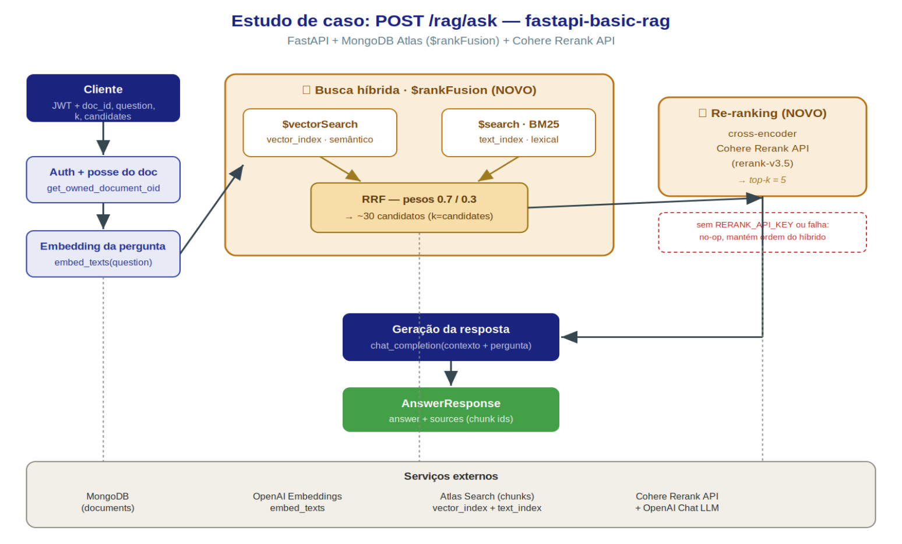
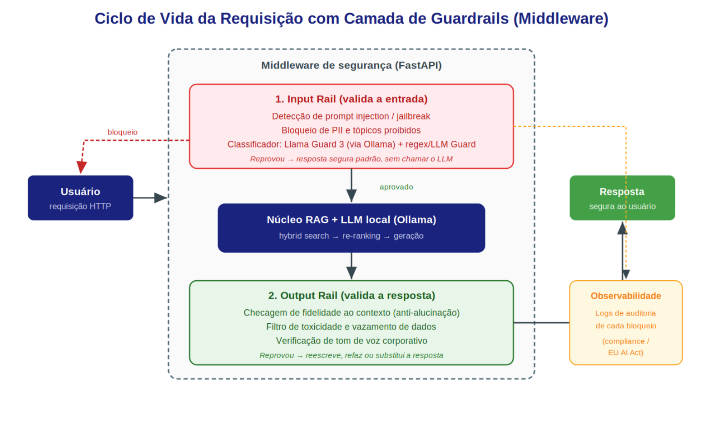

# Arquitetura RAG, Governança e Guardrails

Alunos:
- Cleiton Alves
- Rodolfo Brandão

## Escalabilidade e Precisão na Recuperação (RAG Avançado)

A ideia central neste primeiro pilar é deixar de tratar recuperação de informação como um passo único e passá-la a enxergar como um funil de duas fases: primeiro lançar uma rede ampla para garantir que o documento certo esteja em algum lugar do conjunto recuperado (recall), e em seguida refinar para que o melhor trecho chegue ao topo (precisão). Abaixo são apresentadas algumas técnicas que melhor se encaixam nesse funil.

## Hybrid Search

A respeito da _busca híbrida_, ela basicamente roda duas buscas em paralelo e funde os resultados, sendo elas a busca _léxica_ (por palavra-chave, tipicamente utilizando o algoritmo BM25), que é excelente para correspondências exatas (nomes próprios, siglas, números de cláusula, códigos de erro, etc) e a busca _semântica_ (vetorial), que entende intenção e sinônimos mesmo sem o termo aparecer no texto. A motivação por trás desse “mecanismo” é simples: sistemas de RAG que ignoram a parte léxica falham de forma despercebida justamente na cauda longa de consultas ricas em identificadores, enquanto sistemas que ignoram a parte semântica falham nas consultas conceituais que dependem de sinônimos e intenção.

A parte fundamental que une as duas buscas é a fusão de ranks. O método mais usado nessa etapa é o _Reciprocal Rank Fusion_ (RRF), que combina as posições (ranks) de cada lista de busca sem precisar normalizar escalas de score diferentes, o que é uma grande vantagem porque o BM25 e a técnica de _similaridade de cosseno_ vivem em universos diferentes. Vale também ressaltar que o ganho da busca híbrida é mais expressivo com modelos de embedding menores; com embeddings muito sofisticados, que já codificam bem tanto a parte lexical quanto a semântica, esse ganho tende a diminuir.

## Re-ranking

Sobre essa técnica, tanto o algoritmo BM25 quanto a busca vetorial, usam na primeira fase modelos que olham a consulta e o documento separadamente (denominados _bi-encoders_): rápidos, escaláveis a milhões de vetores, mas que perdem a interação fina entre pergunta e passagem. Já o modelo _cross-encoder_ faz o oposto: recebe o par consulta-documento junto e os processa com atenção cruzada, devolvendo um score de relevância muito mais preciso. O custo é que ele não pode pré-computar nada (cada par é uma inferência) então não serve para varrer uma base inteira. A solução nesse caso seria a padrão de funil: a primeira fase recupera muitos candidatos baratos, e o cross-encoder reordena apenas o topo.

Estudos recentes relatam ganhos consistentes de qualidade da recuperação de informações ao incluir o _re-ranking_ sobre buscas vetoriais, tipicamente na faixa de +5 a +15 pontos de **NDCG@10** (métrica padrão usada na Computação para avaliar a qualidade dos 10 primeiros resultados retornados por mecanismos de busca ou sistemas de recomendação). Casos específicos chegam a relatar melhorias relativas de mais de 30% em acurácia. Em contrapartida, há um custo de latência relevante a ser considerado.

## Chunking Semântico

Contextualizando, entende-se por _chunking_ o particionamento estático por contagem de tokens (cortar a cada 500 tokens, por exemplo). É uma técnica rápida e barata, mas que pode particionar de forma errada, causando rompimento de frases no meio, separando um argumento do seu desfecho ou gerando embeddings de fragmentos gramaticais que não representam ideia alguma. Dessa forma, como um embedding representa exatamente o pedaço que recebe, um chunk que termina no meio de uma frase gera um embedding sem sentido coerente no espaço vetorial. Há ainda um consenso forte de que o chunking é o maior teto de qualidade de um pipeline RAG: nenhum reranker ou ajuste de prompt recupera informação que a fronteira do chunk destruiu.

Já a técnica de _chunking semântico_ particiona os documentos em pontos onde o significado muda, respeitando parágrafos, seções e quebras temáticas, em vez de impor um tamanho fixo. Na prática, existe uma escala de esforço: o particionamento recursivo (que respeita separadores naturais como parágrafos e sentenças) já é um 2 padrão excelente e barato para a maioria dos textos; o semântico propriamente dito (que usa a distância entre embeddings de sentenças para decidir onde cortar) fica reservado para casos em que medimos um problema de recuperação que o recursivo não resolve, como textos técnicos densos ou transcrições com trocas rápidas de assunto.

## Desafio Técnico: Integração com FastAPI em Python

Na prática, é possível manter documentos, metadados e embeddings juntos no MongoDB, criar dois índices (um _full-text_ via o binário `mongot` e um vetorial com grafoHNSW para ANN) e executar a busca híbrida com `$rankFusion`. Isso elimina a fragilidade de manter um segundo sistema sincronizado com o banco principal. A ressalva técnica é que, na Community/Enterprise self-managed, esses recursos ainda estão em preview e operam sobre um binário separado (`mongot`); para produção crítica, o caminho maduro continua sendo o Atlas. A melhor decisão a ser adotada é prototipar localmente na edição Community e manter o Atlas como rota de escala.

Em termos de código, a mudança é incremental e não exige reescrever o serviço
atual. O ideal seria encapsular a recuperação atrás de uma interface única (por
exemplo, um Retriever). O endpoint do FastAPI continua recebendo a pergunta, e nos
bastidores o fluxo passaria a ser:

- Gerar o embedding da pergunta (Ollama) e disparar, na mesma agregação MongoDB, a busca vetorial e a full-text.
- Fundir as duas listas com `$rankFusion`, obtendo ~50 candidatos com pesos ajustáveis por busca.
- Reordenar o topo com o _cross-encoder_ (executado de forma assíncrona / em lote para não bloquear o event loop do FastAPI).
- Montar o prompt apenas com os 3–8 melhores trechos e enviar ao LLM via Ollama

## Estudo de Caso: Implementação de Referência

Partindo de uma premissa mais prática, vale apresentar uma implementação que já percorre exatamente o caminho proposto anteriormente: o repositório [fastapi-basic-rag](https://github.com/cleiton-fraga/fastapi-basic-rag/tree/main) foi melhorado e já documenta a evolução do endpoint **POST** `/rag/ask` de uma busca vetorial de fase única para o fluxo de duas fases (retrieve -> re-rank) descrito acima. Esse é um exemplo simples e didático, mas as decisões de design são as mesmas que as de qualquer serviço de um ambiente produtivo.

Como o fluxo original do projeto era de fase única (embedding da pergunta -> `$vectorSearch` [top-5] -> LLM), ele sofria exatamente do problema descrito na introdução: forte em paráfrase e sinônimo, fraco em siglas, nomes próprios, códigos e números exatos. A correção aplicada foi inserir as duas fases já apresentadas, agora com nomes de função e parâmetros reais.

## Governança e Guardrails

Operar LLMs localmente tem uma contrapartida desconfortável: perdemos os filtros automáticos que provedores de nuvem aplicam por baixo dos panos. Sem eles, cada requisição que entra e cada resposta que sai precisa passar por uma camada de controle interna. Essa camada serve a quatro objetivos que se sobrepõem: garantir conformidade (compliance), evitar alucinações severas, bloquear injeções de prompt maliciosas e manter o tom de voz corporativo.

## O Que São Guardrails

Guardrails são uma camada de software que se fica entre o usuário e o LLM, inspecionando entradas antes que o modelo as veja e validando saídas antes que cheguem ao usuário. A literatura costuma agrupar os riscos tratados em cinco categorias:

1. Alucinação
2. Prompt injection
3. Vazamento de PII
4. Desvio de tópico (topic drift)
5. Conteúdo tóxico

O conceito mais importante é que os guardrails operam em estágios: input rails (filtram o prompt do usuário), dialog rails (guiam o fluxo da conversa) e output rails (filtram ou corrigem a resposta).

## Frameworks Avaliados

Foram investigados frameworks open-source para integração com LLMs locais. A conclusão é que eles não são concorrentes diretos, e sim abstrações para tarefas diferentes (o desenho de produção mais comum os compõem em camadas):

|Framework|O que faz melhor|Observações|
|-|-|-|
|NeMo Guardrails (NVIDIA)|Rails programáveis de fluxo de diálogo, escritas na DSL Colang. Controla tópicos permitidos, força ações e atravessa cinco estágios (input, dialog, retrieval, execution, output).|Forte para impor o tom corporativo e barrar desvios de assunto. Latência típica de ~100–300 ms por checagem (menor em GPU). Curva de aprendizado da Colang e comunidade menor.|
|Guardrails AI|Validação e correção de saída via 'validators' (Hub com dezenas prontos) e specs declarativas. Pode reescrever ou reenviar o prompt quando a saída falha.|Ideal para garantir formato estrutura e checagens de qualidade na saída. Latência de ~50–200 ms por validação, conforme a complexidade.|
|LLM Guard (Protect AI)|Scanners rápidos de entrada e saída (prompt injection, jailbreak, segredos, PII, tópicos banidos). Roda como middleware encadeando scanners.|Simples e barata: mata ataques óbvios antes de qualquer modelo caro rodar.|
|Llama Guard 3 (Meta)|Classificador de segurança open-weight que devolve 'safe/unsafe' + categoria. Roda nativamente via Ollama.|Encaixa-se perfeitamente no nosso stack: o mesmo Ollama que serve o LLM principal serve o guard. Taxa de falso-positivo ~1/3 da taxa do GPT-4 como moderador, no benchmark da Meta.|

Como o Ollama já está no stack, o Llama Guard 3 foi escolhido para ser a espinha dorsal das checagens de conteúdo (input e output) sem introduzir um novo runtime de modelo. A configuração é declarativa: um arquivo YAML aponta o modelo principal e o _llama-guard3_ como engines Ollama, e define rails de _check input_ e _check output_. Em volta dele, scanners baratos (regex/LLM Guard) interceptam ataques óbvios na borda, e o NeMo Guardrails entra quando precisamos de regras de fluxo mais ricas (manter o assistente estritamente no domínio corporativo, recusar certos assuntos, impor tom).

## Desafio Técnico: Filtro de Segurança como Middleware

A proposta arquitetural é tratar a segurança como um middleware no FastAPI: uma camada que envolve o núcleo RAG e intercepta a requisição em dois momentos. Nada chega ao Ollama sem passar pela validação de entrada, e nada chega ao usuário sem passar pela validação de saída.

### Input Rail (antes do Ollama)

- **Detecção de Prompt Injection / Jailbreak**: identificar tentativas de sobrescrever as instruções do sistema. Como a literatura alerta, nenhuma técnica isolada basta. Vale empilhar regex/heurística barata + classificador (Llama Guard).
- **Bloqueio de PII e Tópicos Proibidos**: anonimizar ou recusar entradas com dados sensíveis ou fora do escopo.
- **Curto-circuito**: se a entrada é reprovada, devolvemos uma resposta segura padrão sem nunca acionar o LLM (economizando inferência e evitando risco).

### Output Rail (depois do Ollama, antes do usuário)

- **Fidelidade ao Contexto (anti-alucinação)**: verificar se a resposta se sustenta nos trechos recuperados; do contrário, reescrever, refazer ou substituir a resposta.
- **Toxicidade e Vazamento**: filtrar conteúdo ofensivo e impedir que segredos/PII vazem na resposta.
- **Tom de Voz Corporativo**: garantir que o estilo da resposta esteja alinhado às diretrizes da organização.

## Justificativa Tecnológica

- **MongoDB** (`$rankFusion` / `$vectorSearch` + `$search`): Mantém a busca híbrida nativa dentro do banco já utilizado, sem a necessidade de integração com um segundo sistema.
- **RRF** (Reciprocal Rank Fusion): Funde listas léxicas e vetoriais usando ranks, dispensando a normalização de escalas de score incompatíveis. É o padrão em ambientes produtivos e já vem implementado no $rankFusion.
- **Cross-encoder** (ms-marco-MiniLM / BGE-reranker-v2): Maior salto de precisão por esforço no pipeline de dados. Modelos leves e open-source que rodam em hardware comum e entregam a maior parte do desempenho em relação a alternativas pagas.
- **Chunking Recursivo vs. Semântico**: Recursivo como padrão barato e robusto; semântico reservado para conteúdo onde é preciso medir a perda de recuperação. O chunking é o teto de qualidade do pipeline.
- **Re-rank** (`httpx` + fallback): Padrão para o estudo de caso fastapi-basic-rag. Elimina a necessidade de um SDK pesado, e uma eventual falha no serviço de re-rank não derrubaria o endpoint, apenas devolveria a ordem da busca híbrida.
- **Parâmetros de request** (candidates, k, pesos): Expor o tamanho do funil e os pesos do `$rankFusion` como parâmetros, não constantes, permite calibrar recall vs. custo por chamada.
- **Llama Guard 3 via Ollama**: Reaproveita o runtime existente; o mesmo Ollama serve o LLM e o Guard. É open-weight, possui baixa taxa de falso-positivo e dispensa a dependência de serviço em nuvem.
- **NeMo Guardrails + LLM Guard**: NeMo para regras de fluxo/tom (Colang) e LLM Guard como primeira linha de defesa, com scanners de baixo custo.
- **FastAPI Middleware**: Permite interceptar entrada e saída de dados de forma transparente, sem reescrever os endpoints existentes, e isolar o trabalho do reranker e guards em pools dedicados.

## Trade-offs

### Latência

Este é o custo mais visível. A primeira fase (busca vetorial + BM25) é barata, na casa de dezenas de milissegundos. O re-ranking é o vilão da latência: pode variar entre +100 e +400 ms para reordenar cerca de 100 candidatos, chegando, em casos extremos, a representar de 60% a 80% da latência total do pipeline de recuperação quando o número de candidatos aumenta consideravelmente.

Para mitigar esse possível cenário, recomenda-se um reranker leve (MiniLM de 33M, não um LLM-reranker de bilhões de parâmetros), ordenando um topo pequeno (30, não 1000), com truncamento de documentos para < 512 tokens, chamadas em lote e cache de scores para conteúdos estáveis.

### Memória (RAM / VRAM)

A arquitetura nova carrega mais modelos residentes ao mesmo tempo: além do LLM gerador e do modelo de embedding, agora existem o cross-encoder e o(s) modelo(s) de guarda (Llama Guard 3). Cada um ocupa memória e o Llama Guard, por ser um modelo de grande porte, é o que mais pesa. Manter LLM principal + guard + embedding + reranker simultaneamente em VRAM exige planejamento de capacidade.

Os índices também crescem: o MongoDB precisará de memória para armazenar e servir tanto o índice full-text quanto o vetorial com bom desempenho. O trade-off aqui está entre manter os modelos quentes (mais VRAM, menor latência) ou carregá-los sob demanda (menos VRAM, picos de latência).

### Complexidade Operacional

A arquitetura ganha partes móveis: um pipeline de ingestão com chunking semântico, dois índices para manter sincronizados (uma falha clássica é atualizar o índice vetorial e esquecer o léxico, degradando o recall silenciosamente), e uma camada de guardrails com sua própria configuração e logs. Por outro lado, ao manter 9 tudo dentro do MongoDB evita-se a complexidade, bem maior, de operar um banco vetorial dedicado em paralelo.

## Benefícios

- **Precisão factual mais alta**: a busca híbrida recupera o que a busca densa perdia (identificadores, termos exatos) e o cross-encoder empurra o trecho certo para o topo.

- **Menos alucinação**: contexto mais limpo e relevante reduz o ruído que induz o LLM ao erro; o output rail adiciona uma rede de fidelidade ao contexto.

- **Mitigação de risco de segurança**: input/output rails barram prompt injection, vazamento de PII e conteúdo tóxico (exatamente os filtros que se perdem ao sair de uma infra em nuvem).

- **Conformidade e auditabilidade**: a trilha de logs de cada bloqueio sustenta requisitos de compliance e o tom de voz corporativo, com governança verificável.